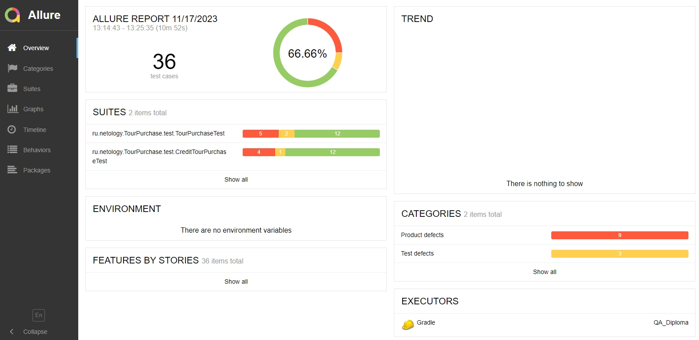
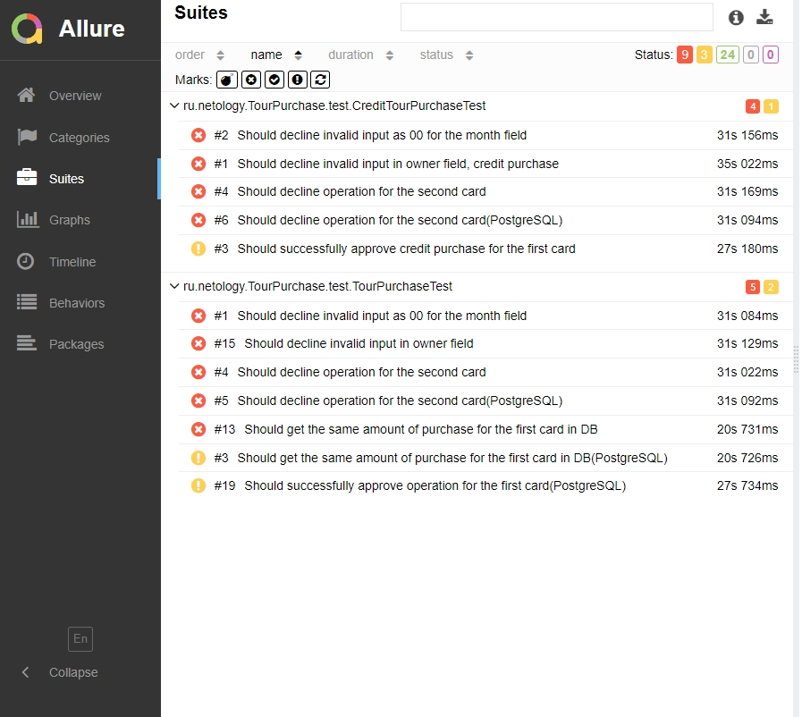

# Краткое описание
В ходе тестирования проверялась работа вэб-сервиса по покупке тура "aqa-shop.jar" и работа эмулятора базы данных.
Были осуществлены проверки:
1. Обязательных функций.
2. Проверки работы форм заполнения.
3. Проверки работы уведомлений.
4. Проверки базы данных.
# Количество тест-кейсов
Было использовано 16 тест-кейсов.
# Количество автотестов
Суммарное количество автотестов - 36, процентное соотношение:
- 66,6% - успешные.
- 25% - проваленные.
- 8,33 - нерабочие. Однако эти тесты рабочие в случае подключения к базе данных через PostgreSQL.
# Общие рекомендации:
- Настроить ограничения для поля "Месяц".
- Настроить ограничения для поля "Владелец".
- Настроить ограничение по сроку действия карт не более 5 лет.
- Настроить эмулятор БД для проверки поля "Номер карты".
- Добавить для кнопок "Купить" и "Купить в кредит" визуальный идентификатор нажатия: на данный момент кнопка "Купить" всегда имеет белый фон, а кнопка "Купить в кредит" - красный. В то время как кнопка "Продолжить" всегда на красном фоне.
# Скриншоты Allure

